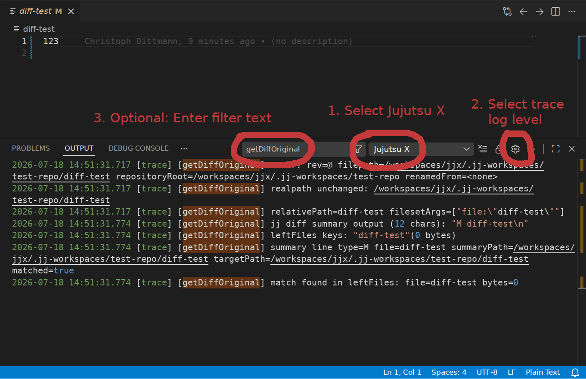

# Debugging

## Collect the logs

Jujutsu X logs to the "Output" pane in VS Code under the "Jujutsu X" channel. You can check the pane for basic
errors/warnings.

In case additional logging is required for debugging an issue, please change the log level to "trace" with the gear icon
and optionally add a filter text to limit the output:

