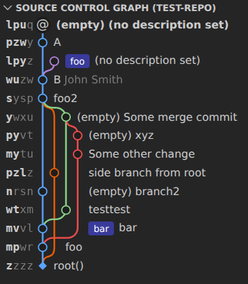
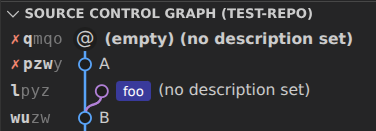
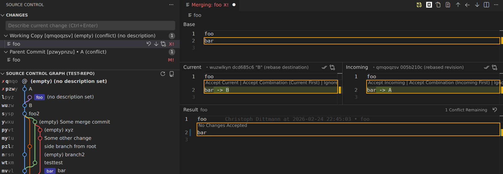

# Jujutsu X

> A Visual Studio Code extension for the [Jujutsu (jj) version control system](https://github.com/jj-vcs/jj). My
> personal development fork of [Jujutsu Kaizen](https://github.com/keanemind/jjk).

## 🚀 Features

The goal of this extension is to bring the great UX of Jujutsu into the VS Code UI. We are currently focused on
achieving parity for commonly used features of VS Code's built-in Git extension, such as the various operations possible
via the Source Control view.

Here's what you can do so far:

### 🔗 Graph View

- Compact graph view  
  
  - Alternative: [Extended graph view](images/full-view.png)
- High information density
  - Minimal change IDs
  - No unnecessary information
  - No author name if it's your own change
- Right-click on a change for a context menu, for example to abandon the change
- Select a change to see its affected files and diffs
- Create merge changes with shift-select
- Drag & drop to rebase
- Drag & drop to squash

### 📁 File Management

- Track file statuses in the working copy
- Monitor file statuses across all parent changes
- View detailed file diffs for working copy and parent modifications 
- View line-by-line blame  
  

### 💫 Change Management

- Create new changes with optional descriptions
- Support both the
  [squash workflow](https://steveklabnik.github.io/jujutsu-tutorial/real-world-workflows/the-squash-workflow.html) and
  the [edit workflow](https://steveklabnik.github.io/jujutsu-tutorial/real-world-workflows/the-edit-workflow.html)
- Edit descriptions of working copy and parent changes  
  
- Move changes between working copy and parents  
  
- Move specific lines from the working copy to its parent changes 
- Discard changes  
  

### ⚠️ Conflicts

- Show conflicts in the graph and change view  
  
- Resolve conflicts with the VS Code merge editor  
  

### 🔀 Divergent changes

- Show divergent changes in the graph and change view
- Allow all meaningful operations on divergent changes

### 🏷️ Bookmark/Tag Management

- Create, move, and delete bookmarks
- Set and delete tags

### 💼 Multi-Workspace support

- Show multiple workspaces in the graph view
- Handle "workspace is stale" errors

### 🔄 Operation Management

- Undo jj operations or restore to a previous state

## 📋 Prerequisites

- Ensure `jj` is installed and available in your system's `$PATH`, or configure a custom path using the `jjx.jjPath`
  setting
- Ensure `jj` is of a recent version (>=0.38.0)

## 🐛 Known Issues

If you encounter any problems, please [report them on GitHub](https://github.com/Christoph-D/jjx/issues/)!

## 📝 License

This project is licensed under the [AGPL-3.0 License](LICENSE). Code from the original project
[Jujutsu Kaizen](https://github.com/keanemind/jjk) is licensed under the MIT License. See [LICENSE.md](LICENSE.md) for
details.
