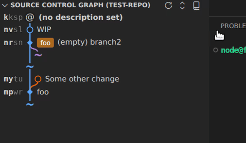
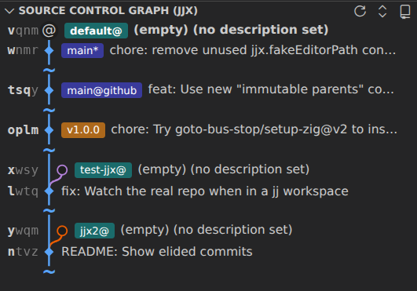
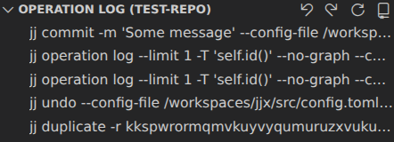

# Jujutsu X

**Jujutsu X** provides a native VS Code experience for the [Jujutsu (jj)](https://github.com/jj-vcs/jj) version control
system—featuring an interactive commit graph, drag-and-drop rebasing, conflict resolution, and more.

Jujutsu X is based on [Jujutsu Kaizen](https://github.com/keanemind/jjk).

## 🚀 Features

### 🔗 Graph view

- Compact graph view  
  
  - Alternative: [Extended graph view](images/full-view.png)
- High information density
  - Minimal change IDs
  - No unnecessary information
  - No author name if it's your own change
- Elided commits  
  
- Right-click on a change for a context menu, for example to abandon the change
- Select a change to see its affected files and diffs
- Create merge changes with shift-select and then pressing the "+" button
- Drag & drop changes onto other changes

### ✋ Drag & drop operations

- Rebase a change (with or without descendants) onto/after/before any other change
- Squash a change into any other change
- Duplicate a change onto/after/before any other change
- Apply the reverse of change (revert) onto/after/before any other change

### 📁 File management

- Show changed files in the working copy and parent changes
- Show changed files in the selected change when clicking on a change in the graph
- Right-click context menu: View as diff, open at revision, open in working copy, copy paths
- Configurable file click action: View as diff, open at revision, open in working copy
- Line-by-line blame annotations (optional)

### 💫 Change management

- Quickly commit with Ctrl+Enter without an editor
- Ctrl+Enter with an empty description opens the full editor
- Commit messages when describing or squashing changes open in the full VS Code editor
- Flexible configuration supports both the
  [squash workflow](https://steveklabnik.github.io/jujutsu-tutorial/real-world-workflows/the-squash-workflow.html), the
  [edit workflow](https://steveklabnik.github.io/jujutsu-tutorial/real-world-workflows/the-edit-workflow.html), and more
- Move changes between working copy and parents
- Move specific lines from the working copy to its parent changes
- Discard changes

### ⚠️ Conflicts

- Show conflicts in the graph and change view  
  
- Resolve conflicts with the VS Code merge editor  
  

### 🔀 Divergent changes

- Show divergent changes in the graph and change view
- Allow all meaningful operations on divergent changes

### 🙈 Hidden changes

- Properly render hidden changes in the graph, for example when a change with a remote bookmark is rewritten locally

### 🏷️ Bookmark/Tag management

- Create, move, and delete bookmarks
- Set and delete tags
- Show conflicted bookmarks and tags with `??` suffix
- Show out-of-sync bookmarks and tags with `*` suffix

### 💼 Multi-Workspace support

- Show workspace labels in the graph view  
  
- Handle "workspace is stale" errors by prompting the user to click a button "update stale workspace"

### 🔄 Operation management

- Browse the operations log with quick undo/redo buttons  
  
- Undo any jj operation or restore repository to a previous state

## 📋 Prerequisites

- Ensure `jj` is installed and available in your system's `$PATH`, or configure a custom path using the `jjx.jjPath`
  setting
- Ensure `jj` is of a recent version (>=0.38.0)

## ⚙️ Configuration

The following settings can be configured in VS Code's settings:

| Setting                             | Default     | Description                                                                                                                                       |
| ----------------------------------- | ----------- | ------------------------------------------------------------------------------------------------------------------------------------------------- |
| `jjx.enableAnnotations`             | `true`      | Enables in-line blame annotations                                                                                                                 |
| `jjx.commandTimeout`                | `null`      | Global timeout in milliseconds for all jj commands. If not set, per-command defaults will be used                                                 |
| `jjx.jjPath`                        | `""`        | Path to the jj executable. If not set, your PATH and common locations will be searched                                                            |
| `jjx.changeEditAction`              | `"edit"`    | Action when clicking the edit button on a change: `"edit"` (jj edit) or `"new"` (jj new)                                                          |
| `jjx.commitAction`                  | `"commit"`  | Action when pressing Ctrl+Enter in source control: `"commit"` (jj commit) or `"new"` (jj new)                                                     |
| `jjx.graphStyle`                    | `"compact"` | Display style for commits: `"full"` shows all details, `"compact"` shows single line                                                              |
| `jjx.pollInterval`                  | `30000`     | Interval in milliseconds between repository polls. Set to 0 to disable                                                                            |
| `jjx.fileClickAction`               | `"diff"`    | Action when clicking a file: `"diff"` (compare to parent), `"at-revision"` (open at clicked revision), or `"working-copy"` (open in working copy) |
| `jjx.elideImmutableCommits`         | `true`      | Hide chains of immutable commits between relevant commits in the graph view                                                                       |
| `jjx.elidedVisibleImmutableParents` | `1`         | Number of immutable parent commits to show in the log when eliding commits                                                                        |
| `jjx.baseWebURL`                    | `""`        | Base URL for the 'Copy URL' feature (e.g., `https://github.com/user/repo`). Overrides `git_web_url()` when set                                    |

## 🐛 Known issues

If you encounter any problems, please [report them on GitHub](https://github.com/Christoph-D/jjx/issues/)!

## 🔧 Troubleshooting

### Double modification annotations ("M, M") in file explorer

If you see annotations like "M, M" next to files, this is caused by VS Code's built-in Git extension running alongside
JJX. To disable Git, disable `git.enabled` in your VS Code settings.

## 📝 License

This project is licensed under the [AGPL-3.0 License](LICENSE). Code from the original project
[Jujutsu Kaizen](https://github.com/keanemind/jjk) is licensed under the MIT License. See [LICENSE.md](LICENSE.md) for
details.
