# Jujutsu X

**Jujutsu X** provides a native VS Code experience for the [Jujutsu (jj)](https://github.com/jj-vcs/jj) version control
system.

## 🚀 Key features

- Interactive commit graph with elided commits like the `jj` CLI
- Efficient: Defaults to showing up to 500 commits, can be configured to show more
- Drag-and-drop for rebase, squash, move bookmarks/tags, and more
- Context menus for change/bookmark/tag operations
- Flexible configuration supports squash and edit workflows and more
- Conflict resolution via the native VS Code merge editor
- Bookmark and tag management with remote sync
- Multi-workspace support with automatic stale workspace updates
- Operation log with undo/redo
- Compare two changes with a diff or interdiff
- Handles divergent commits, conflicted bookmarks, and more

## 📖 Full Feature List

### 🔗 Graph view

- Compact graph view  
  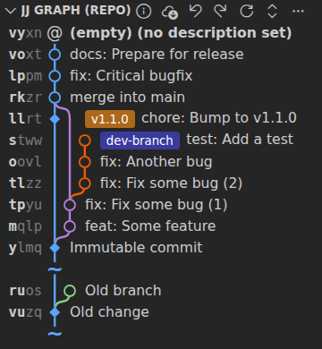 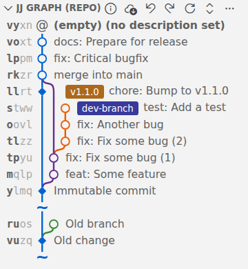
  - Alternative: [Extended graph view](images/full-view.png)
- High information density
- Author name omitted if it's your own change
- Elided commits  
  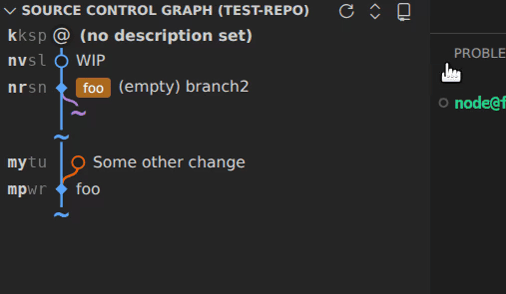
- Select a change to see its affected files and diffs
- Select two changes (shift-click) to compare them. A "Diff" section (`jj diff`) shows the from→to changes by default;
  toggle it to an "Interdiff" section (`jj interdiff`) via the section's inline action
- Create merge changes with shift-select and then pressing the "+" button
- Drag & drop changes onto other changes
- Optionally show each commit's changed files inline in the graph (like `jj log -s`), with one-click diff opening (⚠️
  experimental, enable with `jjx.showChangedFiles`)

### 🖱️ Context menu

- Right click on a change for a context menu  
  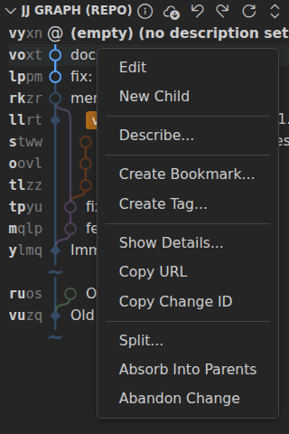
- Edit the change, new child change
- Describe the change
- Manage bookmarks/tags
- Copy the commit's web URL, for example the Github URL
- Copy the full change ID
- Absorb the change into its parents
- Abandon one or more changes (shift-click to select multiple)

### ✋ Drag & drop operations

- Rebase a change (with or without descendants) onto/after/before any other change  
  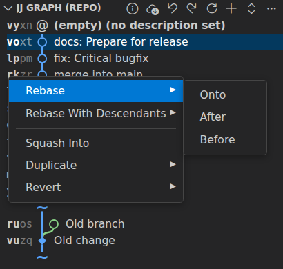
- Squash a change into any other change
- Duplicate a change onto/after/before any other change
- Apply the reverse of change (revert) onto/after/before any other change
- Add or remove parents of a change
- Move bookmarks by dragging them onto a target change

### 📁 File management

- Show changed files in the working copy and parent changes
- Show changed files in the selected change when clicking on a change in the graph
- Compare two selected changes with a diff or interdiff
- Show untracked files (files jj does not ignore but does not track)
- Right-click context menu: View as diff, open at revision, open in working copy, copy paths
- Configurable file click action: View as diff, open at revision, open in working copy
- Line-by-line blame annotations (optional)

### 💫 Change management

- Quickly commit with Ctrl+Enter, no commit message required
- Ctrl+Shift+Enter opens the commit message in the full VS Code editor
- Flexible configuration supports both the
  [squash workflow](https://steveklabnik.github.io/jujutsu-tutorial/real-world-workflows/the-squash-workflow.html), the
  [edit workflow](https://steveklabnik.github.io/jujutsu-tutorial/real-world-workflows/the-edit-workflow.html), and more
- Move changes between working copy and parents
- Move specific lines from the working copy to its parent changes
- Discard changes

### ⚠️ Conflicts

- Show conflicts in the graph and change view  
  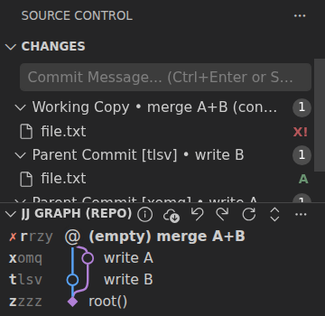
- Resolve conflicts with the VS Code merge editor  
  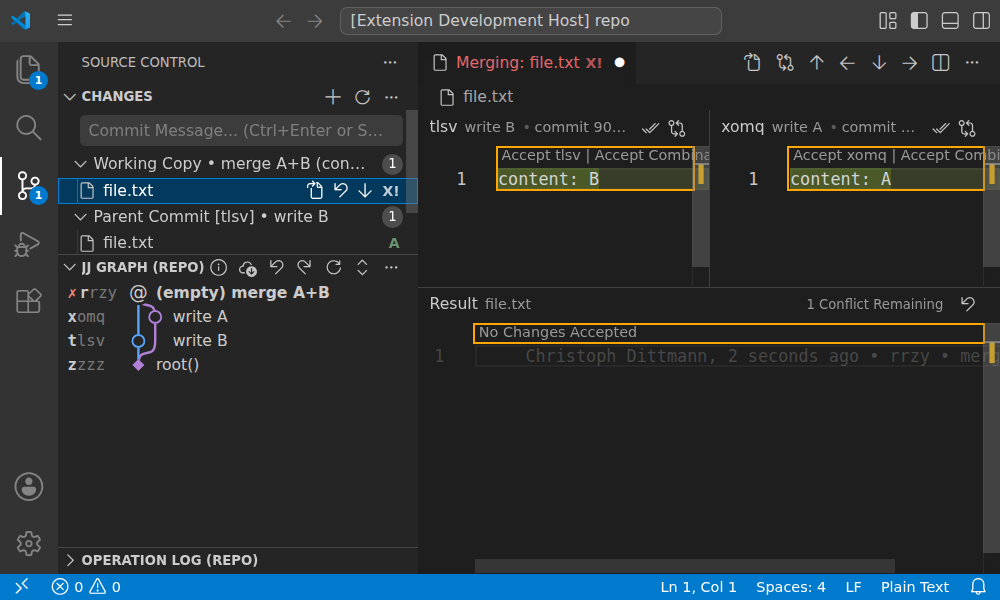

### 🔀 Divergent changes

- Show divergent changes in the graph and change view  
  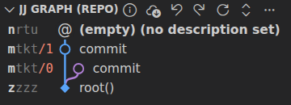

### 🙈 Hidden changes

- Properly render hidden changes in the graph, for example when a change with a remote bookmark is rewritten locally

### 🏷️ Bookmark/Tag management

- Create, move, and delete bookmarks
- Move bookmarks via drag&drop
- Upload a bookmark/tag to all its tracking remotes with a single click (tag tracking requires jj 0.44+)  
  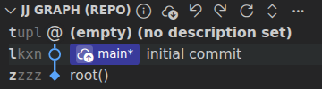
- Right-click context menu to push a bookmark to a specific remote
- Right-click context menu to push a tag to a specific remote
- Track/untrack bookmarks and tags on specific remotes (tag tracking requires jj 0.44+)
- Delete a bookmark/tag  
  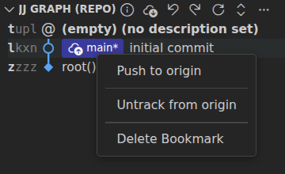
- Set and delete tags
- Show conflicted bookmarks and tags with `??` suffix

### 💼 Multi-Workspace support

- Show workspace labels in the graph view  
  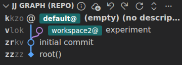
- Automatically update stale workspaces (can be disabled with `jjx.autoUpdateStaleWorkspace`, in which case the user
  will be prompted to update a stale workspace)

### 🔄 Operation management

- Browse the operations log with quick undo/redo buttons  
  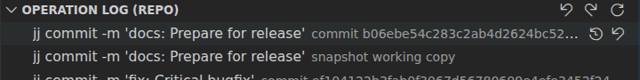
- Undo any jj operation or restore repository to a previous state

## 📋 Prerequisites

- Ensure `jj` is installed and available in your system's `$PATH`, or configure a custom path using the `jjx.jjPath`
  setting
- Ensure `jj` is of a recent version (>=0.38.0)

## ⚙️ Configuration

The following settings can be configured in VS Code's settings:

| Setting                             | Default     | Description                                                                                                                                            |
| ----------------------------------- | ----------- | ------------------------------------------------------------------------------------------------------------------------------------------------------ |
| `jjx.autoUpdateStaleWorkspace`      | `true`      | Automatically run `jj workspace update-stale` when the current workspace is stale                                                                      |
| `jjx.baseWebURL`                    | `""`        | Base URL for the 'Copy URL' feature (e.g., `https://github.com/user/repo`). Overrides `git_web_url()` when set                                         |
| `jjx.changeDoubleClickAction`       | `"new"`     | Action when double-clicking a change in the graph view: `"edit"` (jj edit) or `"new"` (jj new)                                                         |
| `jjx.commandTimeout`                | `null`      | Global timeout in milliseconds for all jj commands. If not set, per-command defaults will be used                                                      |
| `jjx.commitAction`                  | `"commit"`  | Action when pressing Ctrl+Enter in source control: `"commit"` (jj commit) or `"new"` (jj new). Ctrl+Shift+Enter does the same but also opens an editor |
| `jjx.elideImmutableCommits`         | `true`      | Hide chains of immutable commits between relevant commits in the graph view                                                                            |
| `jjx.elidedVisibleImmutableParents` | `1`         | Number of immutable parent commits to show in the log when eliding commits                                                                             |
| `jjx.enableAnnotations`             | `true`      | Enables in-line blame annotations                                                                                                                      |
| `jjx.fileClickAction`               | `"diff"`    | Action when clicking a file: `"diff"` (compare to parent), `"at-revision"` (open at clicked revision), or `"working-copy"` (open in working copy)      |
| `jjx.graphStyle`                    | `"compact"` | Display style for commits: `"full"` shows all details, `"compact"` shows single line                                                                   |
| `jjx.jjPath`                        | `""`        | Path to the jj executable. If not set, your PATH and common locations will be searched                                                                 |
| `jjx.logLimit`                      | `500`       | Maximum number of commits shown in the graph view                                                                                                      |
| `jjx.pollIntervalSeconds`           | `30`        | Interval in seconds between repository polls. Set to 0 to disable                                                                                      |
| `jjx.showChangedFiles`              | `false`     | ⚠️ Experimental: Show changed files for each commit in the graph (similar to `jj log -s`). Clicking a file opens a diff at that revision               |
| `jjx.showTooltips`                  | `true`      | Show tooltips when hovering over commits in the graph view                                                                                             |

## 🐛 Known issues

If you encounter any problems, please [report them on GitHub](https://github.com/Christoph-D/jjx/issues/)!

## 🔧 Troubleshooting

### Double modification annotations ("M, M") in file explorer

If you see annotations like "M, M" next to files, this is caused by VS Code's built-in Git extension running alongside
JJX. To disable Git, disable `git.enabled` in your VS Code settings.

### Performance issues

If you experience performance issues, try these steps:

- Disable `jjx.enableAnnotations`, blame annotations are expensive to compute for large repos
- Lower `jjx.logLimit` to show fewer commits in the graph

## 🙏 Acknowledgements

Jujutsu X is based on [Jujutsu Kaizen](https://github.com/keanemind/jjk).

## 📝 License

This project is licensed under the [AGPL-3.0 License](LICENSE). Code from the original project
[Jujutsu Kaizen](https://github.com/keanemind/jjk) is licensed under the MIT License. See [LICENSE.md](LICENSE.md) for
details.
